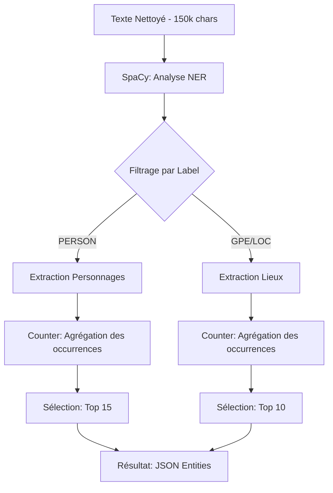

```mermaid
flowchart TD
    A[Texte Nettoyé - 150k chars] --> B[SpaCy: Analyse NER]
    B --> C{Filtrage par Label}
    C -- PERSON --> D[Extraction Personnages]
    C -- GPE/LOC --> E[Extraction Lieux]
    D --> F[Counter: Agrégation des occurrences]
    E --> G[Counter: Agrégation des occurrences]
    F --> H[Sélection: Top 15]
    G --> I[Sélection: Top 10]
    H & I --> J[Résultat: JSON Entities]
```