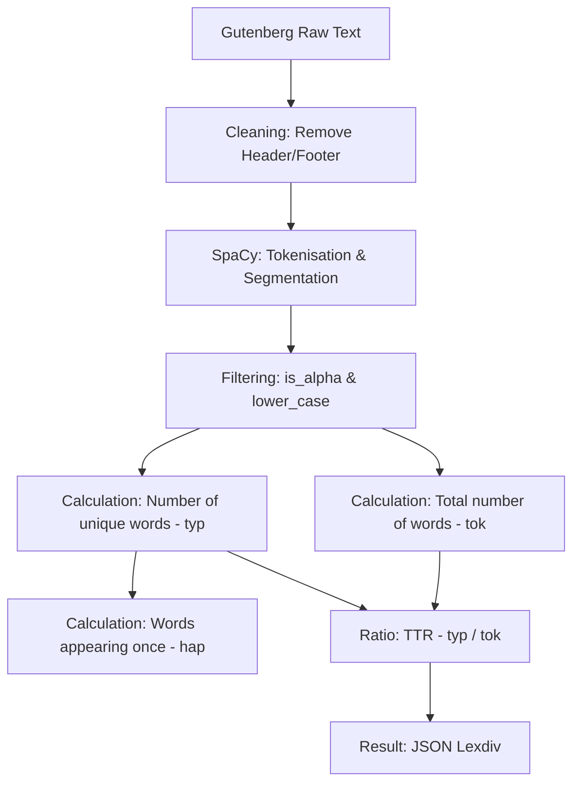

```mermaid
flowchart TD
    A[Gutenberg Raw Text] --> B[Cleaning: Remove Header/Footer]
    B --> C[SpaCy: Tokenisation & Segmentation]
    C --> D[Filtering: is_alpha & lower_case]
    D --> E[Calculation: Total number of words - tok]
    D --> F[Calculation: Number of unique words - typ]
    F --> G[Calculation: Words appearing once - hap]
    E & F --> H[Ratio: TTR - typ / tok]
    H --> I[Result: JSON Lexdiv]
``` 
