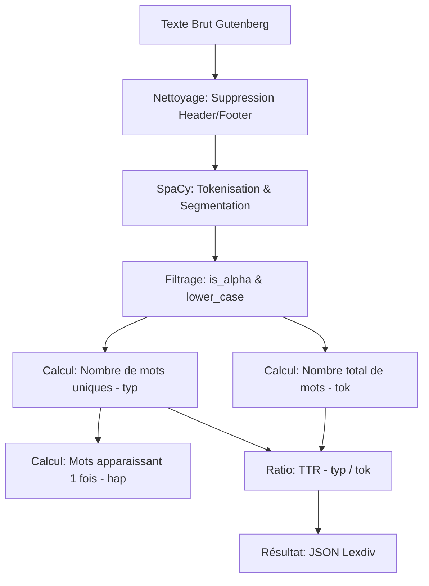

```mermaid
flowchart TD
    A[Texte Brut Gutenberg] --> B[Nettoyage: Suppression Header/Footer]
    B --> C[SpaCy: Tokenisation & Segmentation]
    C --> D[Filtrage: is_alpha & lower_case]
    D --> E[Calcul: Nombre total de mots - tok]
    D --> F[Calcul: Nombre de mots uniques - typ]
    F --> G[Calcul: Mots apparaissant 1 fois - hap]
    E & F --> H[Ratio: TTR - typ / tok]
    H --> I[Résultat: JSON Lexdiv]
``` 