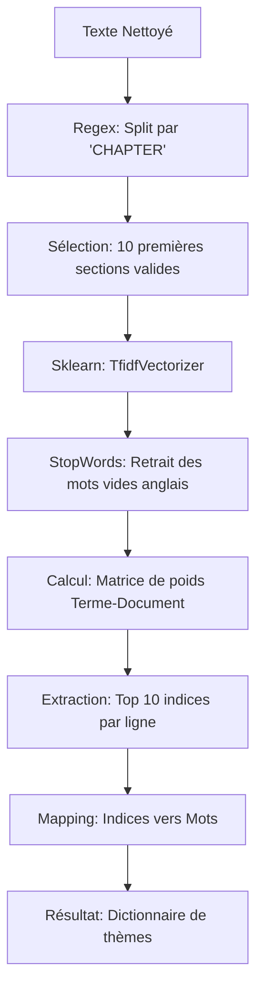

```mermaid
flowchart TD
    A[Texte Nettoyé] --> B[Regex: Split par 'CHAPTER']
    B --> C[Sélection: 10 premières sections valides]
    C --> D[Sklearn: TfidfVectorizer]
    D --> E[StopWords: Retrait des mots vides anglais]
    E --> F[Calcul: Matrice de poids Terme-Document]
    F --> G[Extraction: Top 10 indices par ligne]
    G --> H[Mapping: Indices vers Mots]
    H --> I[Résultat: Dictionnaire de thèmes]
```