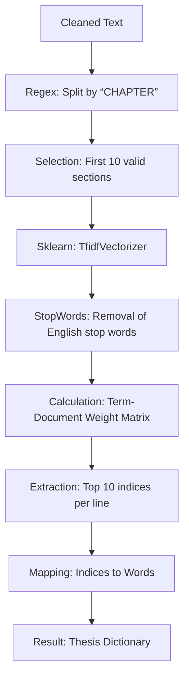

```mermaid
flowchart TD
    A[Cleaned Text] --> B[Regex: Split by “CHAPTER”]
    B --> C[Selection: First 10 valid sections]
    C --> D[Sklearn: TfidfVectorizer]
    D --> E[StopWords: Removal of English stop words]
    E --> F[Calculation: Term-Document Weight Matrix]
    F --> G[Extraction: Top 10 indices per line]
    G --> H[Mapping: Indices to Words]
    H --> I[Result: Thesis Dictionary]
```
